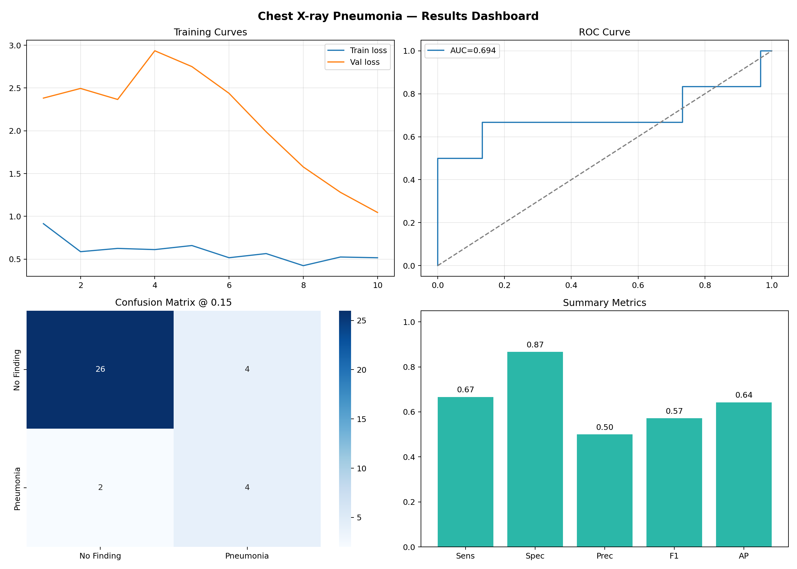
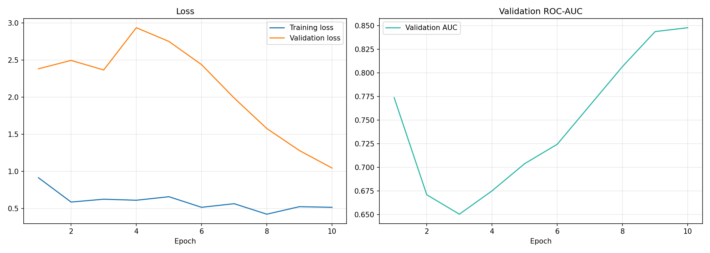
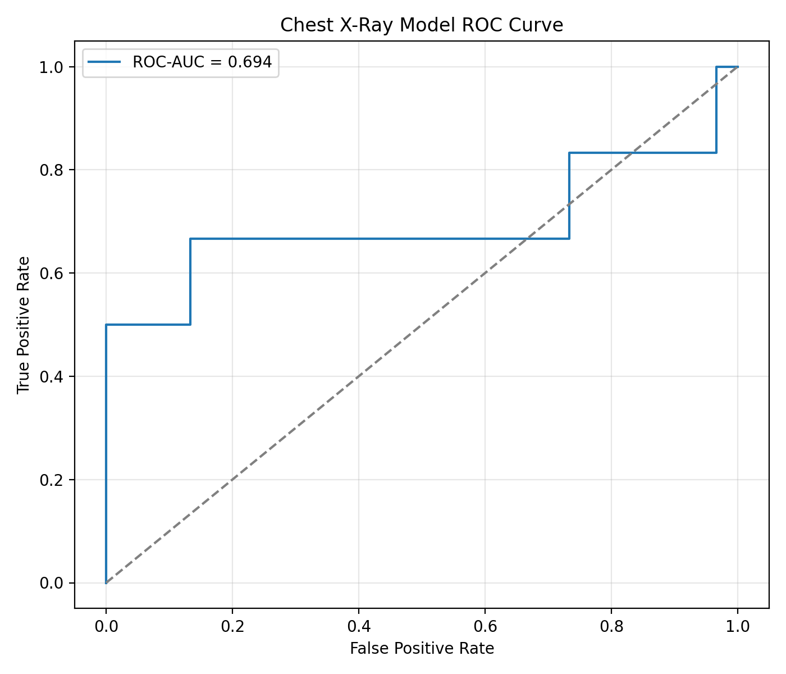
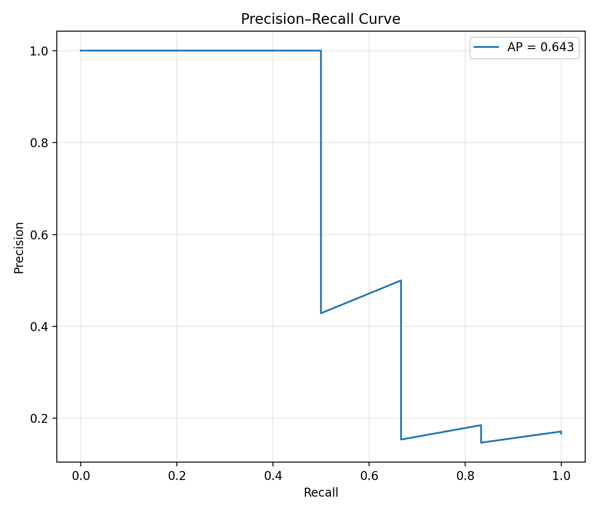
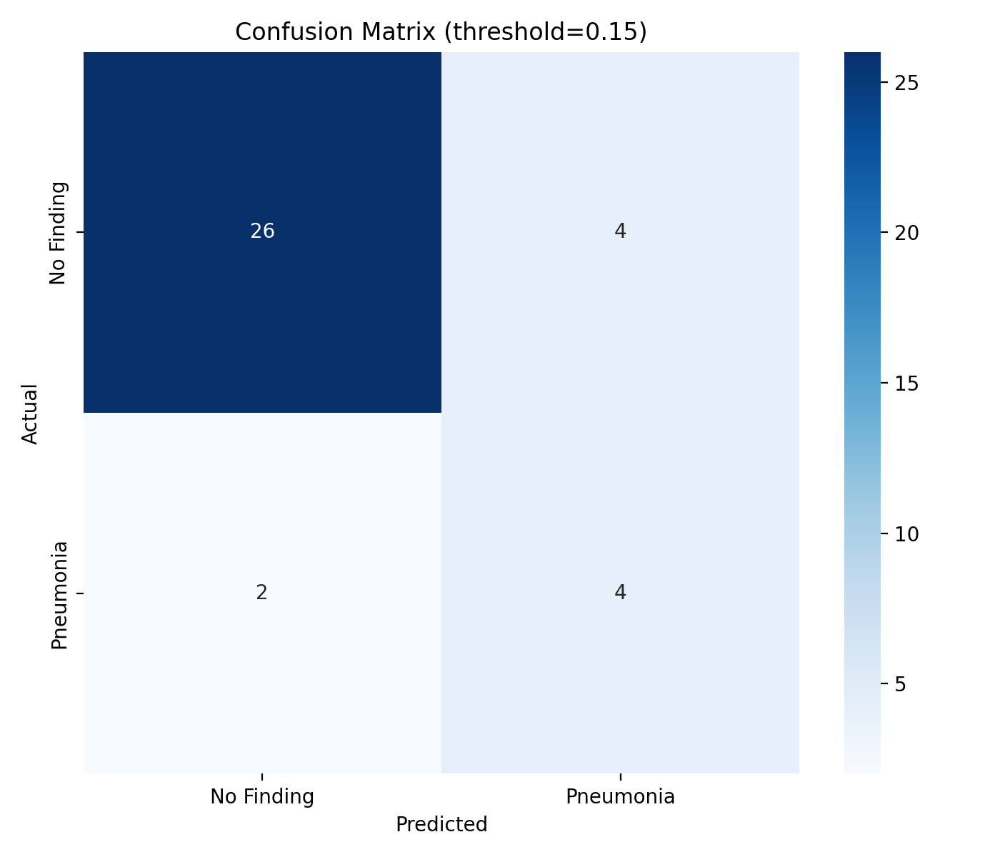
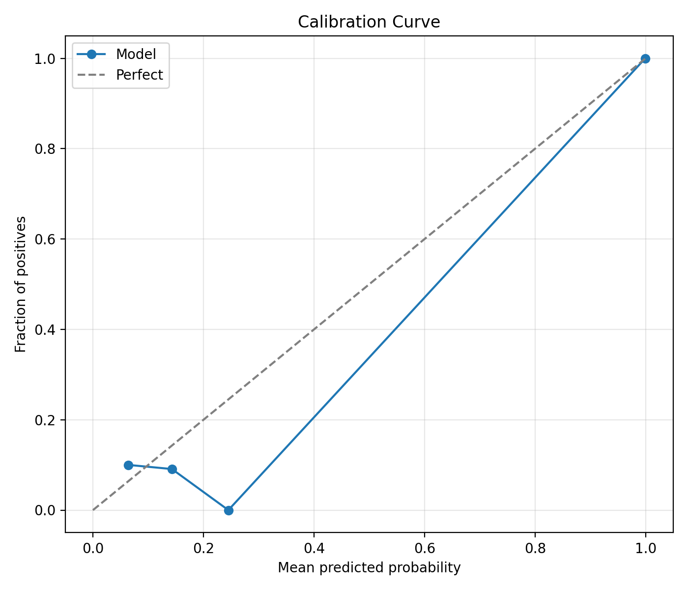

# Chest X-ray Pneumonia Classification

[](https://www.python.org/)
[](https://pytorch.org/)
[](#)
[](#)

End-to-end **PyTorch** pipeline that classifies chest X-rays as **Pneumonia** vs **No Finding**, with patient-level data splits, transfer learning, threshold calibration, evaluation plots, and Grad-CAM explanations — designed as a clean ML engineering portfolio project (CLI only, no web UI).

---

## Why this project

This repo demonstrates practical computer-vision / ML skills that matter in real systems:

| Skill | How it shows up here |
|--------|----------------------|
| Transfer learning | ImageNet-pretrained **ResNet-18**, partial fine-tuning (`layer3`+) |
| Leakage-aware evaluation | **Patient-level** stratified train / val / test splits |
| Class imbalance | `BCEWithLogitsLoss` with **positive class weighting** |
| Decision thresholding | Youden’s *J* optimal threshold (not naive 0.5) |
| Model quality reporting | ROC-AUC, PR-AUC, sensitivity / specificity, F1, Brier, **ECE** |
| Explainability | **Grad-CAM** overlays for single-image inference |
| Software hygiene | Config module, modular scripts, **pytest** unit tests |

---

## Pipeline

```text
prepare_data.py  →  train.py  →  evaluate.py  →  predict.py
     CSVs              weights        metrics/plots      Grad-CAM
```

| Script | Role |
|--------|------|
| `prepare_data.py` | Filter NIH labels, stratified **patient-level** splits |
| `train.py` | Fine-tune ResNet-18, log history, save best checkpoint |
| `evaluate.py` | Test metrics + ROC / PR / confusion / calibration plots |
| `predict.py` | Single-image CLI prediction (+ Grad-CAM by default) |

---

## Results (demo dataset)

The shipped demo set is intentionally small so the full pipeline runs quickly (including in PyCharm). Metrics below are from that demo run — useful for verifying the code path, **not** for clinical claims.

| Metric | Value |
|--------|------:|
| Test size | 36 images |
| ROC-AUC | 0.694 |
| Average precision | 0.643 |
| Sensitivity | 66.7% |
| Specificity | 86.7% |
| Precision | 50.0% |
| F1 | 0.571 |
| Optimal threshold (Youden) | 0.155 |
| Brier score | 0.082 |
| ECE | 0.049 |

### Evaluation visuals

<p align="center">
  
</p>

<p align="center">
  
</p>

<p align="center">
  
  
</p>

<p align="center">
  
  
</p>

### Example prediction + Grad-CAM

```bash
python predict.py data/images_demo/00000001_000.png
```

```text
Prediction: No Finding
Pneumonia score: 10.26%
Threshold: 0.15
Score band: Low
Saved Grad-CAM: models/gradcam_00000001_000.png
```

---

## Dataset

Designed for **[NIH ChestX-ray14](https://nihcc.app.box.com/v/ChestXray-NIHCC)** (binary task: Pneumonia present vs No Finding).

Expected layout:

```text
data/
  Data_Entry_2017.csv
  images_001/   # or images_demo/ for the small local demo
  ...
```

A compact **demo** subset can sit under `data/` so you can practice prepare → train → evaluate → predict without downloading ~40GB. Replace it with the full NIH release for portfolio-grade metrics.

> Note: `data/` is gitignored. Clone the repo, then either use a local demo folder or download NIH ChestX-ray14 into `data/`.

---

## Quick start

```bash
git clone https://github.com/<your-username>/chest-xray-pneumonia-classification.git
cd chest-xray-pneumonia-classification

python3 -m venv .venv
source .venv/bin/activate          # Windows: .venv\Scripts\activate
pip install -r requirements.txt
```

### 1. Prepare splits

```bash
python prepare_data.py
```

### 2. Train

```bash
python train.py
```

Saves:

- `models/best_model.pt`
- `models/training_history.csv`
- `models/training_curves.png`

### 3. Evaluate

```bash
python evaluate.py
```

Writes metrics to `models/metrics.json` and plots under `models/`.

### 4. Predict

```bash
# Uses demo image + Grad-CAM by default (PyCharm-friendly)
python predict.py

# Or pass your own X-ray (PNG / JPG / DICOM)
python predict.py path/to/xray.png
python predict.py path/to/xray.dcm --no-gradcam
```

### Tests

```bash
pytest -q
```

---

## Method (short)

1. **Labels** — images with `Pneumonia` in Finding Labels → positive; `No Finding` → negative  
2. **Splits** — stratified by patient so the same patient never appears in more than one split  
3. **Model** — ResNet-18, ImageNet init, early layers frozen, later blocks + classifier trained  
4. **Loss** — binary cross-entropy with logits + `pos_weight` for imbalance  
5. **Threshold** — chosen on the ROC curve via Youden’s index for a sensitivity / specificity tradeoff  
6. **Explainability** — Grad-CAM on `layer4` for localization-style heatmaps  

Training knobs live in `config.py` (`EPOCHS`, `BATCH_SIZE`, `LEARNING_RATE`, `UNFREEZE_FROM_LAYER`, …).

---

## Project structure

```text
chest-xray-pneumonia-classification/
├── prepare_data.py      # Patient-level CSV splits
├── train.py             # Fine-tuning loop + logging
├── evaluate.py          # Metrics, ECE, plots
├── predict.py           # CLI inference + Grad-CAM
├── dataset.py           # PyTorch Dataset
├── model_factory.py     # ResNet-18 build / load
├── transforms_util.py   # Train / eval transforms
├── inference.py         # Predict + Grad-CAM helpers
├── plots.py             # Matplotlib / Seaborn figures
├── config.py            # Paths & hyperparameters
├── metrics_io.py        # metrics.json helpers
├── requirements.txt
├── tests/               # Unit tests (no NIH required)
└── models/              # Checkpoints, metrics, plots
```

---

## Tech stack

- **Python 3.9+**
- **PyTorch** / **torchvision**
- **scikit-learn**, **pandas**, **NumPy**
- **matplotlib** / **seaborn**
- **pytorch-grad-cam**
- **pydicom** (optional DICOM input)
- **pytest**

---

## Disclaimer

Educational / research portfolio project only. **Not** a medical device and **not** validated for diagnosis or clinical decision support.

---

## License

Use freely for learning and portfolio demonstration. NIH ChestX-ray14 remains subject to its own dataset terms.
